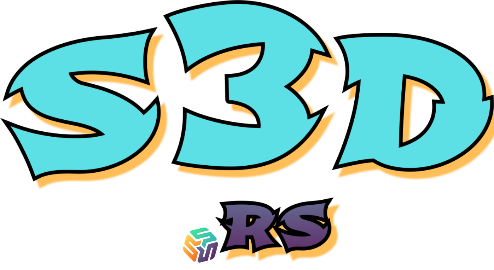

<div id="top"></div>
<div align="center" style="background-color: black; text-align: center">
  <a alt="s3d logo" href="https://s3d.rs" style="background-color: black; text-align: center">
    
  </a>
</div>
<br />
<div align="center">
  <a alt="crate" href="https://crates.io/crates/s3d">
    
  </a>
  <a alt="build" href="https://github.com/s3d-rs/s3d/actions">
    <!--  -->
    
  </a>
  <a alt="discord" href="https://discord.com/channels/897764851580035072">
    
  </a>
  <a alt="license" href="LICENSE">
    
  </a>
  <!--
  <a alt="releases" href="https://github.com/s3d-rs/s3d/releases/latest">
    
  </a>
  <a alt="s3d at docs.rs" href="http://docs.rs/s3d">
    
  </a>
  -->
</div>

# The S3 Daemon

`s3d` is a daemon for data access using S3 API. A modern cousin of `nfsd`, `ftpd`, `httpd`, etc. It is designed to be simple, tiny, blazing fast, and portable in order to fit in a variety of environments from developer machines, containers, kubernetes, edge devices, etc.

By default, `s3d` serves the S3 API as a gateway to a main remote S3 storage (AWS/compatible), with unmatched protocol compatiblity (based on the AWS SDK and Smithy API), and adds the missing features such as (queueing, caching, synching) in order to optimizing performance, increase data availability, and service continuity for its clients.

The need for a daemon running locally with client applications emerges in Edge computing use cases, where data is stored and processed locally at the edge as it gets collected, while some of the data gets synced to and from a main data storage (read more on [Wikipedia - Edge computing](https://en.wikipedia.org/wiki/Edge_computing)):

> Edge computing is a distributed computing paradigm that brings computation and _data storage closer to the sources of data_.
> This is expected to improve response times and save bandwidth.

# Features

1. **S3 API**
   - Generated protocol code with [awslabs/smithy-rs](https://github.com/awslabs/smithy-rs)
   - Parsing of S3 operations, inputs, outputs, errors.
1. **UPLOAD QUEUE**
   - Writing new objects to local filesystem first to tolerate connection issues.
   - Pushing in the background to remote storage.
1. **READ CACHE**
   - Store cached and prefetched objects in local filesystem.
   - Reduce egress costs and latency of reads from remote storage.
1. **SYNC DIR**
   - Continuous, bidirectional and background sync of local dirs to remote buckets.
   - Also known as the "dropbox folder" model.
   - This is a simple way to get data that begins as files to the remote S3 storage.
1. **FUSE MOUNT**
   - Virtual filesystem mount point of the data.
   - For applications that do not support S3 API.
1. **FILTERS**
   - Fine control over which objects to include/exclude for upload/cache/sync.
   - Filter by bucket name, bucket tags, object keys (or prefixes), object tags, and object meta-data.

# Getting Started

The following snippet is a good starting point for getting started with `s3d`.

The [rust tools](https://www.rust-lang.org/tools/install) are required for installing `s3d` from crates.io.

```bash
cargo install s3d # install latest from crates.io
s3d run # runs daemon in foreground ...
s3d status # sanity
s3d speedtest # optional
s3d ls # list all buckets
s3d ls bucket # list objects in bucket
s3d put bucket/key --tag s3d.upload=false < file  # upload and keep local only
s3d tag bucket/key s3d.upload=true s3d.cache=pin # upload and pin to cache
s3d get bucket/key > file # download
s3d help
```

# Architecture

- [Architecture page](docs/architecture.md) - describes key components and concepts.

# Configurations

- [Configuration guide](docs/config.md) - help on features, configurations and environment variables.

# Development

- [Developer guide](docs/dev.md) - describes how source control, building and testing works.

# Roadmap

- [Roadmap page](docs/roadmap.md) - directions for future development.

# Project

> :warning: &nbsp; **Experimental status warning** &nbsp; :telescope:
>
> This project is still in it's early days, which means it's a great time to affect its direction, and we welcome contributions and open discussions.
>
> Keep in mind that all internal and external interfaces are considered unstable and subject to change without notice.

- [Github issues](https://github.com/s3d-rs/s3d/issues) - please let us know on any issues/question/suggestion.
- [Discord channels](https://discord.com/channels/897764851580035072) - use this [invite link](https://discord.gg/kPWHDuCdhh) to join.
- [Redhat-et](https://github.com/redhat-et) - this project was initiated by Red Hat Emerging Technologies.
- [License](LICENSE) - Apache 2.0
